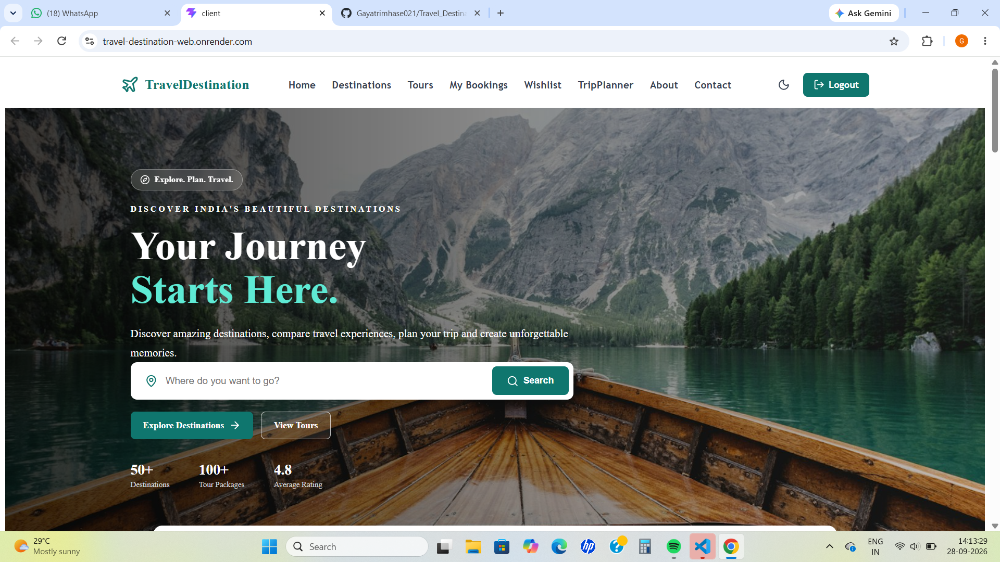
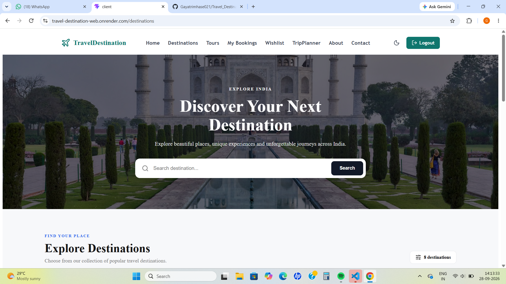
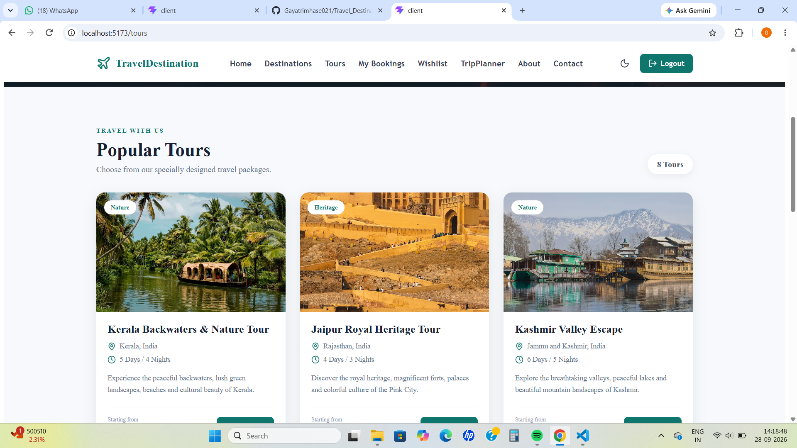

# TravelDestination

## Smart Travel & Tour Management System

TravelDestination is a full-stack web application designed to make travel planning easier and more organized. Users can explore destinations, discover tours, plan trips, save favourite destinations, make bookings and manage their travel activities through a simple and responsive interface.

## Live Project

https://travel-destination-web.onrender.com/

## GitHub Repository

https://github.com/Gayatrimhase021/Travel_Destination

## Project Screenshots

### Home

### Destinations

### Tours

## Project Objective

The main objective of TravelDestination is to provide a centralized platform where users can explore travel destinations, discover tours, plan trips, save favourite places and manage bookings efficiently.

## Key Features

- User Registration and Login
- Explore Travel Destinations
- Destination Details
- Tour Listing and Tour Details
- Wishlist Management
- Smart Trip Planner
- Tour Booking
- My Bookings
- Tour Reviews and Ratings
- Contact Form
- Responsive Design
- JWT-based Authentication
- MongoDB Database Integration

## Technology Stack

### Frontend

- React.js
- JavaScript
- HTML5
- CSS3
- React Router
- Axios
- Lucide React Icons

### Backend

- Node.js
- Express.js
- REST API
- JWT Authentication

### Database

- MongoDB
- Mongoose

### Deployment

- GitHub
- Render

